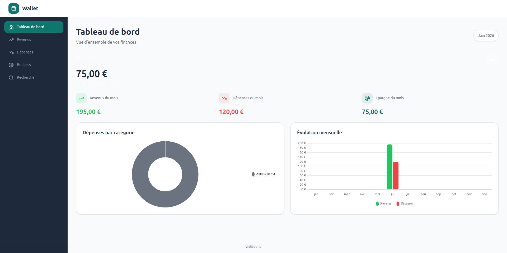

# Wallet - Application de Gestion de Finances Personnelles

Application fullstack de gestion de finances personnelles : suivez vos revenus, dépenses, budgets et exportez vos transactions en PDF/CSV.

  

## Fonctionnalités

- **Authentification sécurisée** - JWT avec Spring Security
- **Revenus** - CRUD complet, recherche par mot-clé
- **Dépenses** - CRUD avec 6 catégories, filtrage par catégorie
- **Tableau de bord** - Solde, revenus/dépenses du mois, taux d'épargne
- **Graphiques interactifs** - Doughnut par catégorie, Bar mensuel (Chart.js)
- **Budgets** - Mensuels, globaux ou par catégorie, avec alertes automatiques
- **Recherche avancée** - 8 critères combinables (type, catégorie, date, montant...)
- **Export** - PDF et CSV en un clic
- **Design soigné** - Interface minimaliste avec Tailwind CSS et Lucide Icons

## Aperçu

| Page | Description |
|------|-------------|
| **Dashboard** | Solde total, statistiques mensuelles, graphiques |
| **Revenus** | Liste, ajout/modification/suppression, recherche |
| **Dépenses** | Liste avec badges de catégorie, filtres |
| **Budgets** | Barres de progression, alertes visuelles |
| **Recherche** | Filtres avancés, export PDF/CSV |

## Architecture du projet

├── wallet-backend/ # API REST Spring Boot

│ └── src/main/java/com/kabobi/wallet/

│ ├── config/ # CORS, Security

│ ├── controller/ # 8 contrôleurs REST

│ ├── dto/ # 17 DTOs

│ ├── exception/ # Gestion globale des erreurs

│ ├── model/ # 5 entités JPA

│ ├── repository/ # 5 repositories

│ ├── security/ # JWT, Spring Security

│ └── service/ # 7 services métier

└── wallet-frontend/ # SPA Vue 3

└── src/

├── components/ # 12 composants

├── composables/ # Hooks (useFormat, useNotification)

├── router/ # 8 routes protégées

├── services/ # 8 services Axios

├── stores/ # 6 stores Pinia

├── types/ # Types TypeScript

└── views/ # 7 pages

## Stack Technique

### Backend
| Technologie | Version |
|-------------|---------|
| Java | 21 |
| Spring Boot | 3.2.0 |
| Spring Security | 6.1 |
| PostgreSQL | 16 |
| Flyway | 9.22 |
| JWT (jjwt) | 0.12 |
| iTextPDF | 5.5 |
| OpenCSV | 5.8 |

### Frontend
| Technologie | Version |
|-------------|---------|
| Vue | 3.4 |
| TypeScript | 5.3 |
| Vite | 5.0 |
| Pinia | 2.1 |
| Vue Router | 4.2 |
| Axios | 1.6 |
| Chart.js | 4.4 |
| Tailwind CSS | 3.4 |
| Lucide Icons | 0.344 |

## Installation

### Prérequis
- Java 21+
- Node.js 20+
- PostgreSQL 16+
- Maven 3.9+

### 1. Cloner le projet
git clone https://github.com/votre-username/wallet.git
cd wallet

### Base de données
sudo service postgresql start
sudo -u postgres psql*

### Backend
cd wallet-backend
./mvnw spring-boot:run
API disponible sur http://localhost:8080

### Frontend
cd wallet-frontend
npm install
npm run dev
Interface disponible sur http://localhost:5173

API - Principaux Endpoints

Authentification

POST /api/auth/signup    # Inscription

POST /api/auth/signin    # Connexion → JWT

Revenus

GET    /api/revenues              # Liste

POST   /api/revenues              # Créer

GET    /api/revenues/{id}         # Détail

PUT    /api/revenues/{id}         # Modifier

DELETE /api/revenues/{id}         # Supprimer

Dépenses

GET    /api/expenses              # Liste

POST   /api/expenses              # Créer

GET    /api/expenses/{id}         # Détail

PUT    /api/expenses/{id}         # Modifier

DELETE /api/expenses/{id}         # Supprimer

Dashboard & Budgets

GET /api/dashboard                # Tableau de bord

GET /api/budgets/alerts           # Alertes budget

POST /api/export/pdf              # Export PDF

POST /api/export/csv              # Export CSV

### Design System
Usage	Couleur	Hex

Primaire	Teal foncé	#0F766E

Sidebar	Bleu nuit	#1E293B

Revenus	Vert	#22C55E

Dépenses	Rouge	#EF4444

Alertes	Orange	#F59E0B

Fond	Gris clair	#F8FAFC

Cartes	Blanc	#FFFFFF

Typographie : Inter • Icônes : Lucide

### Sécurité

Tous les endpoints (sauf /api/auth/**) sont protégés par JWT

Tokens valables 24h

Mots de passe hashés avec BCrypt

CORS configuré pour le frontend uniquement

Rôles : USER, ADMIN

### Projet réalisé par
JEAN-LEON KABOBI 
jeanleon.kabobi@gmail.com / kabobi.jeanleon.dev@gmail.com

